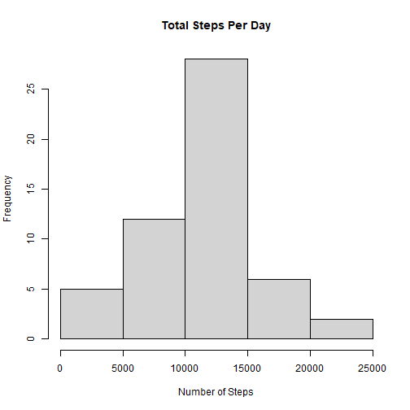
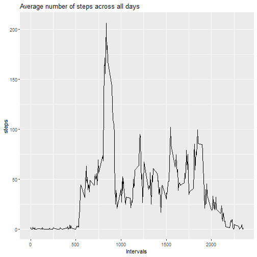
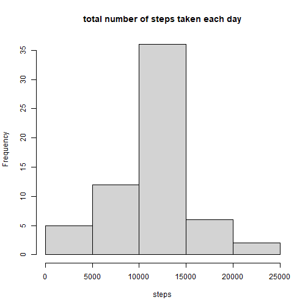
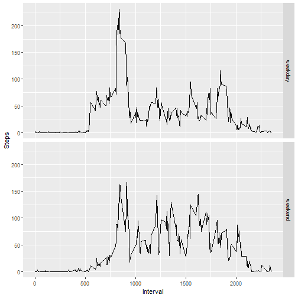

## **Loading and preprocessing the data **

1. Load the data from [here](https://d396qusza40orc.cloudfront.net/repdata%2Fdata%2Factivity.zip) 

```r
setwd("C:/Users/dongj/Desktop/R_data_Desk/Reproducible_Research")
data <-read.csv("./repdata_data_activity/activity.csv")
```

2. Process/transform the data (if necessary) into a format suitable for your analysis

```r
head(data,10)
```

```
##    steps       date interval
## 1     NA 2012-10-01        0
## 2     NA 2012-10-01        5
## 3     NA 2012-10-01       10
## 4     NA 2012-10-01       15
## 5     NA 2012-10-01       20
## 6     NA 2012-10-01       25
## 7     NA 2012-10-01       30
## 8     NA 2012-10-01       35
## 9     NA 2012-10-01       40
## 10    NA 2012-10-01       45
```

```r
summary(data)
```

```
##      steps            date          
##  Min.   :  0.00   Length:17568      
##  1st Qu.:  0.00   Class :character  
##  Median :  0.00   Mode  :character  
##  Mean   : 37.38                     
##  3rd Qu.: 12.00                     
##  Max.   :806.00                     
##  NA's   :2304                       
##     interval     
##  Min.   :   0.0  
##  1st Qu.: 588.8  
##  Median :1177.5  
##  Mean   :1177.5  
##  3rd Qu.:1766.2  
##  Max.   :2355.0  
## 
```

## **What is mean total number of steps taken per day?**

1. Calculate the total number of steps taken per day

```r
total_steps_per_day <- aggregate(steps ~ date, data, sum)
##Checking first 5 data for total steps per day
head(total_steps_per_day,5)
```

```
##         date steps
## 1 2012-10-02   126
## 2 2012-10-03 11352
## 3 2012-10-04 12116
## 4 2012-10-05 13294
## 5 2012-10-06 15420
```
2. If you do not understand the difference between a histogram and a barplot, research the difference between them. Make a histogram of the total number of steps taken each day

Histogram

```r
hist(total_steps_per_day$steps, main= "Total Steps Per Day", xlab="Number of Steps")
```



3. Calculate and report the mean and median of the total number of steps taken per day


```r
mean_of_total_number_of_steps <-mean(total_steps_per_day$steps,na.rm=TRUE)
median_of_toal_number_of_steps <-median(total_steps_per_day$steps, na.rm=TRUE)
mean_of_total_number_of_steps
```

```
## [1] 10766.19
```

```r
median_of_toal_number_of_steps
```

```
## [1] 10765
```

## **What is the average daily activity pattern?**

1.Make a time series plot (i.e. type = "l"\color{red}{\verb|type = "l"|}type = "l") of the 5-minute interval (x-axis) and the average number of steps taken, averaged across all days (y-axis)


```r
library(ggplot2)
average_number_of_steps <- aggregate(steps~interval, data, mean)
ggplot(average_number_of_steps, aes(x=interval, y = steps))+geom_line()+ labs(title="Average number of steps across all days", x= "Intervals", y= "steps")
```




2. Which 5-minute interval, on average across all the days in the dataset, contains the maximum number of steps?


```r
max_steps <- average_number_of_steps[which.max(average_number_of_steps$steps),]
print(max_steps)
```

```
##     interval    steps
## 104      835 206.1698
```
## **Imputing missing values**

1.Calculate and report the total number of missing values in the dataset (i.e. the total number of rows with NAs)

```r
##colSums(is.na(data))
table(is.na(data))
```

```
## 
## FALSE  TRUE 
## 50400  2304
```


2.Devise a strategy for filling in all of the missing values in the dataset. The strategy does not need to be sophisticated. For example, you could use the mean/median for that day, or the mean for that 5-minute interval, etc.

```r
mean_interval <- aggregate(steps~interval, data, mean)
new_data<-merge(x=data, y=mean_interval, by="interval")

new_data$steps <-ifelse(is.na(new_data$steps.x), new_data$steps.y, new_data$steps.x)

head(new_data)
```

```
##   interval steps.x       date  steps.y    steps
## 1        0      NA 2012-10-01 1.716981 1.716981
## 2        0       0 2012-11-23 1.716981 0.000000
## 3        0       0 2012-10-28 1.716981 0.000000
## 4        0       0 2012-11-06 1.716981 0.000000
## 5        0       0 2012-11-24 1.716981 0.000000
## 6        0       0 2012-11-15 1.716981 0.000000
```

3.Create a new dataset that is equal to the original dataset but with the missing data filled in.


```r
library(dplyr)
```

```
## 
## Attaching package: 'dplyr'
```

```
## The following objects are masked from 'package:stats':
## 
##     filter, lag
```

```
## The following objects are masked from 'package:base':
## 
##     intersect, setdiff, setequal, union
```

```r
new_data<-select(new_data, steps, date, interval)

head(new_data)
```

```
##      steps       date interval
## 1 1.716981 2012-10-01        0
## 2 0.000000 2012-11-23        0
## 3 0.000000 2012-10-28        0
## 4 0.000000 2012-11-06        0
## 5 0.000000 2012-11-24        0
## 6 0.000000 2012-11-15        0
```

4.Make a histogram of the total number of steps taken each day and Calculate and report the mean and median total number of steps taken per day. Do these values differ from the estimates from the first part of the assignment? What is the impact of imputing missing data on the estimates of the total daily number of steps?


```r
new_step <-aggregate(steps~date, new_data, sum)
hist(new_step$steps, main="total number of steps taken each day", xlab="steps")
```



Mean/Median of Number of Steps

```r
summary(new_step$steps)
```

```
##    Min. 1st Qu.  Median    Mean 3rd Qu.    Max. 
##      41    9819   10766   10766   12811   21194
```

```r
## Using Summary, we know about Min, 1st Quantile, Median, Mean, 3rd Quantile, MAx and NA's
```

## **Are there differences in activity patterns between weekdays and weekends?**

1.Create a new factor variable in the dataset with two levels – “weekday” and “weekend” indicating whether a given date is a weekday or weekend day.


```r
##Function 
## if date is  Saturday, Sunday
##    then weekends
## if not weekday
weekend_or_not <- function(date) {
  dates <- weekdays(date)
  if (dates %in% c('Saturday', 'Sunday'))
    return ("weekend")
  else
    return ("weekday")
}
new_data$date <- as.Date(new_data$date)
new_data$dates <- sapply(new_data$date, FUN = weekend_or_not)
head(new_data)
```

```
##      steps       date interval   dates
## 1 1.716981 2012-10-01        0 weekday
## 2 0.000000 2012-11-23        0 weekday
## 3 0.000000 2012-10-28        0 weekend
## 4 0.000000 2012-11-06        0 weekday
## 5 0.000000 2012-11-24        0 weekend
## 6 0.000000 2012-11-15        0 weekday
```

2.Make a panel plot containing a time series plot (i.e.type = "l") of the 5-minute interval (x-axis) and the average number of steps taken, averaged across all weekday days or weekend days (y-axis). See the README file in the GitHub repository to see an example of what this plot should look like using simulated data.


```r
new_mean_interval<- aggregate(steps~interval+dates, new_data,mean)
head(new_mean_interval)
```

```
##   interval   dates      steps
## 1        0 weekday 2.25115304
## 2        5 weekday 0.44528302
## 3       10 weekday 0.17316562
## 4       15 weekday 0.19790356
## 5       20 weekday 0.09895178
## 6       25 weekday 1.59035639
```

```r
ggplot(new_mean_interval, aes(x=interval, y=steps))+geom_line()+facet_grid(dates ~.)+ labs(x="Interval", y="Steps")
```




